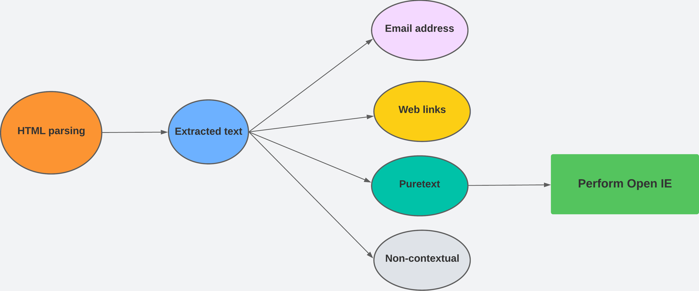
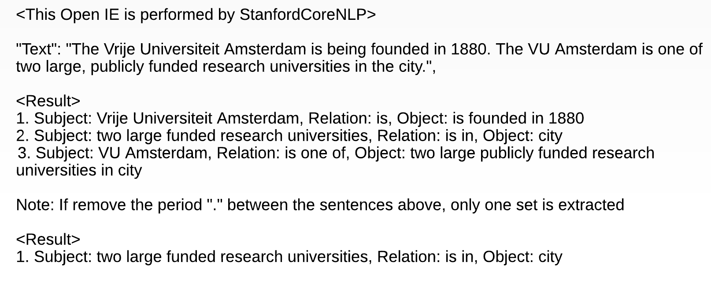

# Bachelor Thesis Computer Science 

# "Extract text from HTML pages for advanced relation extraction"
# Abstract
This paper presents a text extraction model that employs HTML parsing and preprocessing
techniques for advanced relation extraction. The HTML parsing approach focuses
on decoding HTML text contents and optimizing HTML tag identification to eliminate
unnecessary or redundant information while securely preserving relevant content. The preprocessing
stage involves stripping the extracted text and categorizing it into four labels
to prioritize textual information. The target text contents are then centered, and Open
IE, utilizing the Python NLP library provided by StanfordCoreNLP, is employed as the
chosen model for relation extraction. In evaluating the proposed model, an experiment
was conducted, emphasizing runtime, efficiency, and accuracy as evaluation aspects to
assess its performance. The model successfully reduced the size of extracted text contents
from Wikipedia and eBook pages while minimizing runtime. Furthermore, compared to
the base model with both HTML-based datasets, the proposed model achieved higher
precision, recall, and F1 score, indicating improved accuracy. Consequently, the proposed
model not only increases efficiency but also enhances the accuracy of relation extraction.
improved accuracy. Consequently, the proposed model not only increases efficiency
but also enhances the accuracy of relation extraction.
# HTML Parsing
- Read and decode HTML text contents
    - Our HTML parsing engine is designed to read and decode HTML content using the following method:
      
      ```
      html_content = response.read().decode('utf-8')
      ```
- Optimizing HTML tag identification
    - Conduct an HTML tag experiment with 10 websites to evaluate HTML tags. The code for the HTML Tag experiment can be found in [Tag_experiment](./Tag_experiment).
    - Based on the experiment, filter out the following tags: ["script", "style", "image", "iframe", "button", "title", "label", "nav", "footer"].
    - Handle the tag selection using the `tag_stack` in `OIE_extracted_text.py`.
# Preprocessing
- Noise removal
    - To remove noise and unwanted characters, the Python built-in string method `strip()` is utilized, enabling the removal of leading and trailing whitespace or specific characters from the strings extracted from HTML pages.
- Prioritizing the textual information
    - our method categorizes the extracted text into four labels, which are `Email`, `Weblinks`, `Puretext`, and `Noncontextual`, as depicted in the picture below.

      

-  Our engine employs such a categorization system based on predefined text formats and patterns, which are as follows:
      
      ```
      self.email_pattern = re.compile(r'\b[A-Za-z0-9._%+-]+@[A-Za-z0-9.-]+\.[A-Z|a-z]{2,}\b')
      self.url_pattern = re.compile(r'^(?:https?://|www\.)\S+\.[a-zA-Z]{2,}(?:[/?#]\S*)?$')
      Noncontextual = re.search(r'[a-zA-Z0-9]', data)
      ```

# Open IE
- The relation extraction model utilized in this experiment is based on a Python NLP library
provided by the [StanfordCoreNLP](https://nlp.stanford.edu/software/openie.html) framework. To extract relations or information from text, we can utilize the `openie` annotator within the 
framework. 
- Here is an example of text input and its corresponding result in the picture below. When the extracted text contains two sentences with a period (’.’) separating them, the Open IE model extracts three sets of triples from the input. However, if the period is missing between the two sentences, the model only extracts one set of triples.
  
    
# Datasets
- The structure of the dataset essentially encompasses all the anticipated subject-verb-object triples extracted by the Open IE model.
- The datasets and related text are available in the folder [Datasets](./Datasets).
- We have selected two real HTML-based websites for datasets. The first website is a [Wikipedia page](https://en.wikipedia.org/wiki/Vrije_Universiteit_Amsterdam) while the second is an [eBook](https://www.gutenberg.org/cache/epub/27137/pg27137-images.html) presented in HTML format. The text contents from these websites are extracted and compiled into a dataset.
# Experiment
 - Base model vs Our model
 - For the base model, run the code: `OIE_whole.py`
 - For our model, run the code: `OIE_extraced_text.py`
# Conclusion
Our HTML parsing approach primarily focuses on decoding HTML text contents and optimizing HTML tag identification to remove unnecessary or redundant information while preserving the relevant content securely. The preprocessing stage involves stripping the extracted text and prioritizing textual information by categorizing it into four labels. After centering the target text contents, Open IE is performed the Python NLP library provided by StanfordCoreNLP. In order to evaluate our proposed model, we conducted an experiment considering runtime, efficiency, and accuracy as evaluation aspects to assess its performance. As a result, our model successfully reduced the size of extracted text contents from Wikipedia and eBook pages while minimizing the runtime. Additionally, our model achieved higher precision, recall, and F1 score compared to the base model with both datasets, demonstrating improved accuracy. Therefore, we can conclude that our proposed model not only increases efficiency but also improve the accuracy of relation extraction, thereby ensuring the extraction of more reliable information that aligns efficiently with the primary goal of relation extraction.
