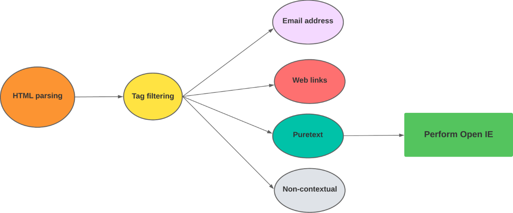
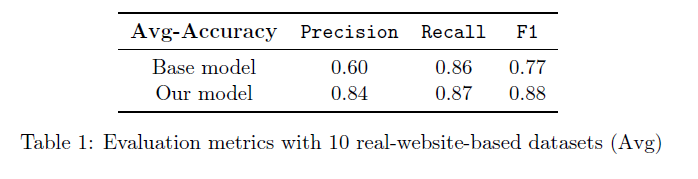

# Bachelor Thesis Computer Science 

# Topic: "Extract text from HTML pages for advanced relation extraction"
# Abstract
Developing highly efficient techniques for extracting text from HTML pages holds significant
potential advantages as well as challenges due to the complexities of web pages.
This paper introduces automated text extraction through HTML, which employs effective
methods such as HTML parsing and noise elimination, to facilitate relation extraction.
The HTML parsing approach focuses on decoding HTML text contents and tag filtering
to eliminate unnecessary information while preserving relevant content securely. In the
noise elimination stage, the text is stripped and prioritized, centralizing the text content
to optimize extraction for relation extraction. For this purpose, the chosen model
is the Open IE system provided by StanfordCoreNLP, which targets the extraction of
subject-verb-object triples. To systematically evaluate the efficacy of the proposed methods,
a series of comprehensive experiments were conducted on ten real HTML-based
websites. The obtained results were meticulously compared against those of a baseline
model, which deployed a simplistic approach, involving direct text extraction from HTML
pages without any of the three processes: HTML parsing, tag filtering, or noise elimination.
The findings reveal that our model successfully achieved reduced extracted text
size, improved runtime, and higher accuracy compared to the baseline model. These
outcomes demonstrate the model’s capability to overcome the intricacies of HTML formatting
and attain accurate text extraction results.
# HTML Parsing
- Read and decode HTML text contents
    - Our HTML parsing engine is designed to read and decode HTML content using the following method:
      
      ```
      html_content = response.read().decode('utf-8')
      ```
- Optimizing HTML tag identification
    - Conduct an HTML tag experiment with 10 websites to evaluate HTML tags. The code for the HTML Tag experiment can be found in [Tag_experiment](./Tag_experiment).
    - Based on the result, only extract text from "title" and "scrip" inside of the "head" tag
    - Within the "body" tag,  filter out the following tags: ["style", "iframe", "svg", "form", "button", "footer", "nav"].
    - Handle the tag selection using the `tag_stack` in `OIE_proposed_model.py`.
- Execute JavaScript code in a headless Chrome browser
    - Create the function: `def execute_javascript_code`, for this execution
    - Set Chrome options for running the browser in a headless mode (without UI)
        ```
            # Set Chrome options for running the browser in a headless mode (without UI)
            options = webdriver.ChromeOptions()
            options.add_argument("--headless")

            # Create a new instance of the Chrome browser with the defined options
            driver = webdriver.Chrome(options=options)

            # Load a blank page in the browser to execute the provided JavaScript code
            driver.get('data:text/html;charset=utf-8,<!DOCTYPE html><html><head></head><body></body></html>')
        ```
    - Implementation can be found in `test_WebDriver.py`
# Noise elimination
- Noise removal
    - To remove noise and unwanted characters, the Python built-in string method `strip()` is utilized, enabling the removal of leading and trailing whitespace or specific characters from strings extracted from HTML pages.
- Prioritizing the textual information
    - Our engine categorizes the extracted text into four labels, which are `Email`, `Weblinks`, `Puretext`, and `Noncontextual`, as depicted in the picture below.

      

-  Our engine employs such a categorization system based on predefined text formats and patterns, which are as follows:
      
      ```
      self.email_pattern = re.compile(r'\b[A-Za-z0-9._%+-]+@[A-Za-z0-9.-]+\.[A-Z|a-z]{2,}\b')
      self.url_pattern = re.compile(r'^(?:https?://|www\.)\S+\.[a-zA-Z]{2,}(?:[/?#]\S*)?$')
      Noncontextual = re.search(r'[a-zA-Z0-9]', data) # Check if data contains no letters or digits (non-contextual data)
      ```

# Open IE
- The relation extraction model utilized in this experiment is based on a Python NLP library
provided by the [StanfordCoreNLP](https://nlp.stanford.edu/software/openie.html) framework. To extract relations or information from text, we can utilize the `openie` annotator within the 
framework. 
- Make sure to have openie-assembly-5.0-SNAPSHOT.jar in the same folder
    1. Download the openie-assembly-5.0-SNAPSHOT.jar at: https://drive.google.com/file/d/19z8LO-CYOfJfV5agm82PZ2JNWNUPIB6D/view
    2. Start the server by:
          ```
          java -mx4g -cp "*" edu.stanford.nlp.pipeline.StanfordCoreNLPServer -port 9000 -timeout 15000
          ``` 
    3. Run: python3 OIE_proposed_model.py on another terminal
- Here is an example of text input and its corresponding result in the picture below. When the extracted text contains two sentences with a period (’.’) separating them, the Open IE model extracts three sets of triples from the input. However, if the period is missing between the two sentences, the model only extracts one set of triples.
  
    

- Such demo with string input can be tested by `OIE_string.py`
# Datasets
- In order to conduct an experiment to evaluate the performance of our automated text extraction
model, we have selected 10 real HTML-based websites for analysis. The selected websites encompass a diverse range of sources, including official university websites, blogs, online articles, news platforms, as well as food and travel reviews. 
- The structure of the dataset essentially encompasses all the anticipated subject-verb-object triples extracted by the Open IE model.
- The datasets and related text are available in the folder [Datasets](./Datasets).

# Experiment
 - Base model vs Our model, in terms of efficiency, runtime, and accuracy.
 - Besemodel is involving direct text extraction from HTML pages without any of the three processes: HTML parsing, tag filtering, or noise elimination, run the code: `OIE_basemodel.py`
 - Our proposed model extracts text with HTML parsing, tag filtering, and noise elimination, run the code: `OIE_proposed_model.py`

 # Result
 - Regarding efficiency, the average percentage reduction among all ten websites is approximately 63%, the figure is available [Efficiency_result](./Figures/Efficiency_result.png)
 - Regarding runtime, the optimized model improved runtime efficiency by 4.29 seconds (55.27% decrease) across all websites, the figure is available [Runtime_result](./Figures/Runtime_result.png)
 - Regarding accuracy:

    
# Conclusion
In conclusion, we presented our efficient
text extraction techniques utilizing HTML
parsing and noise elimination for advanced
relation extraction. Our HTML parsing
approach primarily focuses on decoding
HTML text contents and tag filtering to
remove unnecessary or redundant information
while preserving the relevant content
securely. The noise elimination stage involves
stripping the extracted text and prioritizing
textual information by categorizing
it into four labels. After centering the target
text contents, we employed Open IE using
the Python NLP library provided by StanfordCoreNLP
as our chosen model for relation
extraction. In evaluating our proposed
model, we conducted experiments focusing
on runtime, efficiency, and accuracy as evaluation
aspects to assess its performance. As
a consequence, our model successfully reduced
the size of extracted text contents
from ten real HTML-based websites while
minimizing the runtime. Additionally, our
model achieved higher precision, recall, and
F1 score compared to the base model with
all the ten HTML-based datasets, demonstrating
improved accuracy. Therefore, we
can conclude that our proposed model not
only increases efficiency but also improve
the accuracy of relation extraction, thereby
ensuring the extraction of more reliable information
that aligns efficiently with the primary
goal of relation extraction.

# Thesis Paper
Thesis paper is [here](./Bsc_thesis.pdf).
